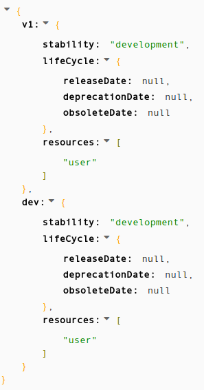

Contenedor de API
-----------------

El contenedor de versiones de api se configura como modulo de la aplicación.

Dentro del contenedor se definen las versiones soportadas por el api.

El modulo de contendedor de versiones debe extender la clase
`tecnocen\roa\modules\ApiContainer`.

Ejemplo de Modulo Contenedor de Api
-----------------------------------

> backend/config/main.php
```php
    'bootstrap' => ['api'],
    'modules' => [
        'api' => ['class' => BackendApi::class],
    ],
```

```php
class BackendApi extends \tecnocen\roa\modules\ApiContainer
{

   public $identityClass => models\User::class;

   public $versions = [
       'v1' => ['class' => v1\Version::class],
       'v2' => ['class' => v2\Version::class],
   ];
}
```

Propiedad `$versions`
---------------------

La propiedad `$versions` declarara las versiones soportadas y las clases de
los modulos asociados a cada versión.

El indice determina el identificador de las versiones así como la ruta de
consumo de cada versión.

Propiedad `$identiyClass`
-------------------------

Esta propiedad declaral a clase usada para identificar al usuario que consume
el api.

Permite el modulo de api reescribe la propiedad `Yii::$app->identityClass` con
este valor antes de crear los recursos del api.

Esto permite cambiar la forma de acceso del usuario para usar tokens en lugar de
sesiones y cookies.

Detalle de las Versiones
------------------------

Se puede realizar una solicitud a la ruta de la versión para encontrar el detalle
de las versiones incluyendo su estabilidad.



[Documentación de Modulos de Version](api-version.md)
